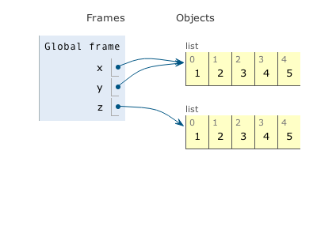
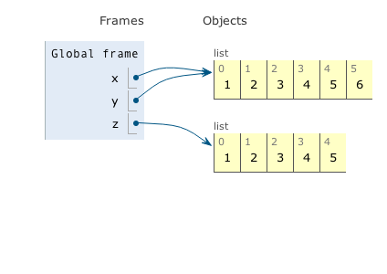
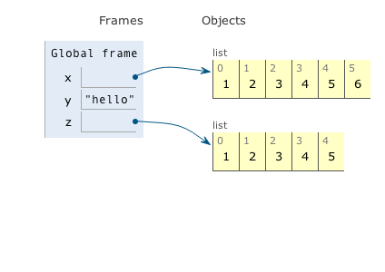

# Render static screenshots of Online Python Tutor visualizations

Nov 2013: I've written a [script](render-opt-screenshots.js) that uses
[PhantomJS](http://phantomjs.org/) to create screenshots of Online Python Tutor
data structure visualizations as `.png` files.
These files can be included in a textbook or online tutorial.

To run this script, first [install PhantomJS](http://phantomjs.org/download.html) and then run:

    phantomjs render-opt-screenshots.js test.py

Doing so will pass `test.py` to Online Python Tutor (which requires online connectivity)
and render the state at each step `i` as a file named `test.py.step.<i>.png`.

This example run generates 23 files, since there are 23 total execution steps. Here are some example files.

Step 11 (`sample-screenshots/test.py.step.11.png`):

Step 12 (`sample-screenshots/test.py.step.12.png`)

Step 13 (`sample-screenshots/test.py.step.13.png`)

